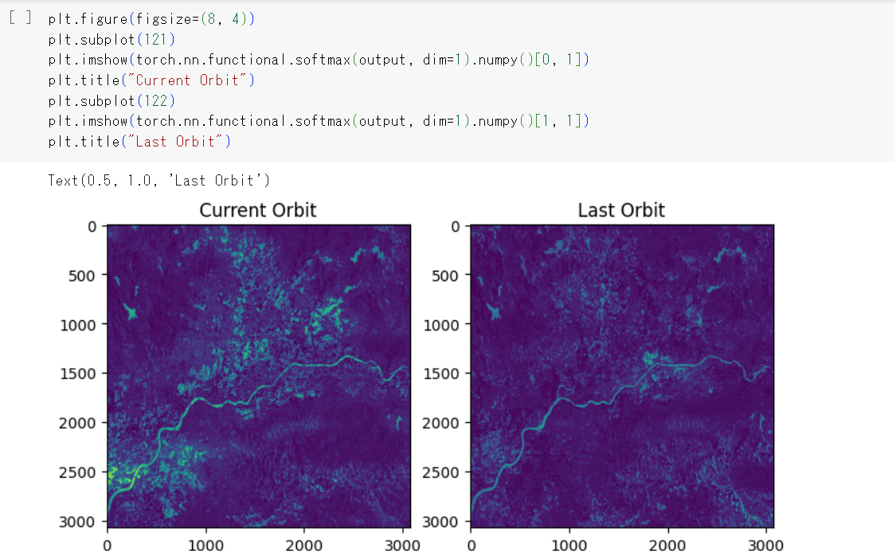
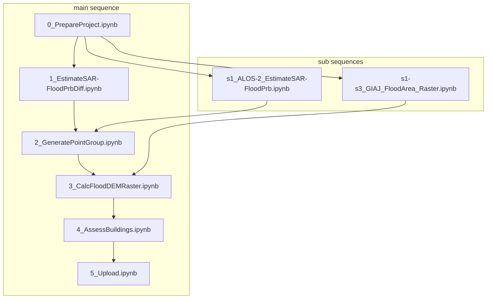
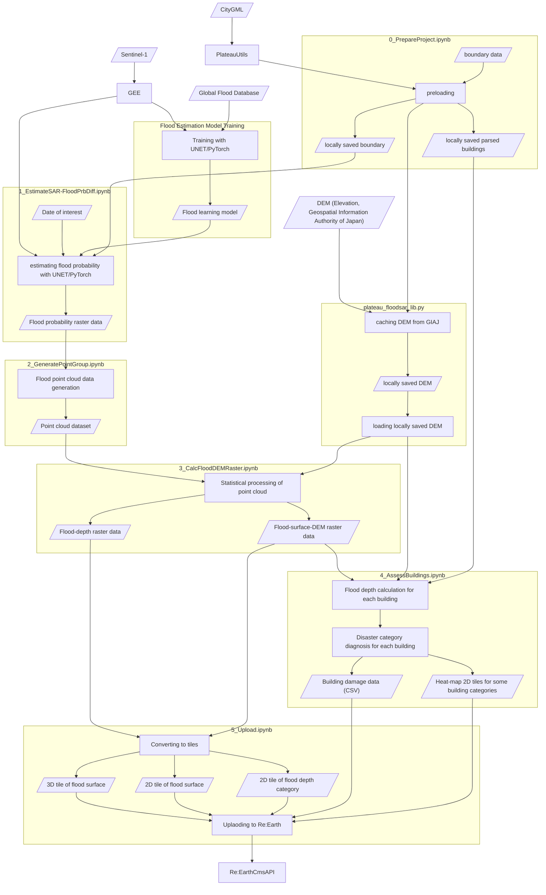

<<<<<<< FCCtakasawa-patch-1
# SAR衛星解析による洪水被害の推定 <!-- OSSの対象物の名称を記載ください。分かりやすさを重視し、できるだけ日本語で命名ください。英語名称の場合は日本語説明を（）書きで併記ください。 -->

 <!-- OSSの対象物のスクリーンショット（画面表示がない場合にはイメージ画像）を貼り付けください -->

## 1. 概要 <!-- 本リポジトリでOSS化しているソフトウェア・ライブラリについて1文で説明を記載ください -->
本リポジトリでは、Project PLATEAUの令和4年度のユースケース開発業務の一部であるUC23-01「人工衛星観測データを用いた浸水被害把握等」について、その成果物である「SAR衛星解析による洪水被害の推定システム」のソースコードを公開しています。

「SAR衛星解析による洪水被害の推定システム」は、洪水時に撮影されたSAR衛星データとPLATEAUの3D都市モデルを活用し、洪水時の浸水範囲や、浸水深といった洪水被害を推定するシステムです。

## 2. 「人工衛星観測データを用いた浸水被害把握等」について <!-- 「」内にユースケース名称を記載ください。本文は以下のサンプルを参考に記載ください。URLはアクセンチュアにて設定しますので、サンプルそのままでOKです。 -->
「人工衛星観測データを用いた浸水被害把握等」では、洪水等の浸水被害発生直後の人工衛星観測データ（SARデータ）から分析した浸水範囲と3D都市モデルの地形モデル及び建築物モデルをマッチングさせることで、家屋単位での浸水深の算出および被災判定を行うシステムを開発する。さらに、導出された被災家屋リストをデータベース化し、WebGISエンジン上で可視化するシステムを構築することで、行政における罹災証明書発行業務の効率化を目指す。
本システムは、人工衛星観測データ（SARデータ）によって取得された浸水範囲と、3D都市モデルが持つ家屋情報を組み合わせて分析することで、家屋単位の浸水深を算出するウェブシステムを開発した。
本システムは、行政職員向けのGUIを備えたオープンソースソフトウェアとしてフルスクラッチで開発されています。
本システムの詳細については[技術検証レポート](https://www.mlit.go.jp/plateau/file/libraries/doc/plateau_tech_doc_0030_ver01.pdf)を参照してください。

## 3. 利用手順 <!-- 下記の通り、GitHub Pagesへリンクを記載ください。URLはアクセンチュアにて設定しますので、サンプルそのままでOKです。 -->
本システムの構築手順及び利用手順については[利用チュートリアル](https://r5-plateau-acn.github.io/SolarPotential/)を参照してください。

## 4. システム概要 <!-- OSS化対象のシステムが有する機能を記載ください。 -->
### 【人工衛星観測データの解析】
#### ⓪プロジェクトの初期・3D都市モデル（CityGML）の読み込み（0_PrepareProject.ipynb）
- 解析対象となるCityGMLと、対象エリアとなる領域の緯度・経度情報またはポリゴンデータを入力することで、CityGMLを解析して、対象エリアの建物データを生成し、日本の地理情報機関からデジタル標高モデル（DEM、5mメッシュ）を事前にダウンロードします。
- ここでは、GoogleDriveへの接続が必要となります。

#### ①SARデータの読み込み・SARデータによる浸水確率ラスターデータの推定（1_EstimateSAR-FloodPrbDiff.ipynb）
- 対象となる洪水日を指定することでその日の人工衛星観測データを、GoogleEarthEngineからSentinel-1の人工衛星観測データを取得し、これを利用して浸水学習モデルを使用して、浸水エリアを分類します。
- 出力は浸水確率ラスターデータであり、洪水時の人工衛星観測データとその前の人工衛星観測データの浸水確率の差を示しています。
- ここでは、GoogleDriveへの接続が必要となります。

#### ②浸水ポイントクラウドデータの生成（2_GeneratePointGroup.ipynb）
- 浸水確率ラスターデータで特定の閾値を超える確率の差があるピクセルを浸水に分類する。その後、ピクセルはグリッドシステムの違いを克服するために点群データを形成する多数のランダムポイントに変換される。
- ここでは、GoogleDriveへの接続が必要となります。
- 以下のパラメータ調整が可能です。

#### ③浸水面の高度ラスターデータと浸水深データの生成（3_CalcFloodDEMRaster.ipynb）
- 浸水ポイントクラウドデータから浸水面の高度ラスターデータと浸水深データを生成します。
- ここでは、GoogleDriveへの接続が必要となります。
- 以下のパラメータの調整が可能です。

#### ④建物への浸水深付与（4_AssessBuildings.ipynb）
- 建物データと浸水面の高度ラスターデータを使用して、建物の被災データ（CSV形式）を生成します。
- 各建物への浸水深は、DEM内の建物の位置と浸水レベルの高低差によって決定される。その後、建物は構造種別と浸水深に基づいて異なる被災カテゴリに分類され、床上浸水か床下浸水かどうかが判定される。
- ここでは、GoogleDriveへの接続が必要となります。

### 【解析結果のアップロード】
#### ⑤Re:Earth CMSへのアップロード（5_Upload.ipynb）
- 前項目で生成したデータを読み込み、データをRe:Earth CMSにアップロードします。
- ここでは、GoogleDriveへの接続・Re:Earth CMSとの認証が必要となります。

### 【プログラム】
#### DEMデータの補正用のプログラム（plateau_floodsar_lib.py）
- ⓪、③、④で呼び出されるプログラムです。
- 日本の地理情報機関からDEMタイルをダウンロードし、ローカルに保存。複数のタイプのDEMデータ（例：DEM5A、DEM5B）を統合し、ジオイド高さを計算し、指定されたエリアの値を抽出および補完します。

### 【GIAJ浸水エリアのGeoJSONファイルの分析（サブシーケンス）】
#### GIAJ GeoJSONから浸水面の高度ラスターデータの生成（s1-s3_GIAJ_FloodArea_Raster.ipynb）
- ローカルに保存されたJSONファイルで動作します。
- GIAJ GeoJsonから洪水面高度ラスターデータを生成します。
- メインステップ①〜③を代替します。
- このファイルを実行した後、メインステップ④で続行してください。
- ここでは、GoogleDriveへの接続が必要となります。

### 【ALOS-2の分析（サブシーケンス）】
#### ALOS-2の分析（s1_ALOS-2_EstimateSAR-FloodPrb.ipynb）
- ローカルに保存されたGeoTIFFファイルで動作します。ローカルのALOS-2 SARデータをGoogle Driveにアップロードし、tiff_pathの場所を指定してください。
- メインステップ①を代替します。
- このファイルを実行した後、メインステップ②で続行してください。
- ここでは、GoogleDriveへの接続が必要となります。
- 注意: このファイルはプロトタイプであるため、対象エリアはローカルのSAR TIFFファイルに含まれている必要があります。
- データを見つけるヒントについてはFindSARofJapan.mdを読んでください。

### 【ASNARO-2の分析（サブシーケンス）】
#### ASNARO-2の分析（s1-s2_ASNARO-2_EstimateSAR_FloodPrb.ipynb）
- ローカルに保存されたGeoTIFFファイルで動作します。
- メインステップ①～②を代替します。
- このファイルを実行した後、メインステップ③で続行してください。
- ここでは、GoogleDriveへの接続が必要となります。

## 5. 利用技術

| 種別              | 名称   | バージョン | 内容 |
| ----------------- | --------|-------------|-----------------------------|
| アプリケーション       | [Google Colaboratory](https://colab.research.google.com/?hl=ja) |  | Googleが提供するクラウドベースのJupyterノートブック環境 |
|       | numpy | 1.23.5 | 数値情報処理の根幹ライブラリ |
|       | requests | 2.31.0 | APIアクセスに利用 |
|       | progressbar | 4.2.0 | 実行時間の予想と把握のためのライブラリ |
|       | matplotlib | 3.7.1 | グラフ描画ライブラリ |
|       | scipy | 1.11.4 | 数学、科学、工学分野の数値解析ライブラリ |
|       | ee | - | Google Earth Engine (GEE)を利用するためのライブラリ |
|       | SNAPPY | - | SAR衛星観測データの前処理ライブラリ |
|       | S1-Tiling |- | SAR衛星観測データの前処理ライブラリ |
|       | PyTorch | 1.11.0 | Deep Learningフレームワーク（AIの構造定義や学習/判読処理のために使用） |
|       | torchvision | 0.16.0+cu121 | PyTorchプロジェクトに含まれているパッケージ |
|       | MLFlow | 1.26.1 | AI実験管理用ライブラリ（AI学習結果・学習時設定パラメータ管理に使用） |
|       | pyproj | 3.6.1 | 座標変換用のライブラリ |
|       | rasterio | 1.3.9 | 地理空間情報画像操作ライブラリ（変化検出結果からGISデータへの変換に使用） |
|       | sklearn | 1.2.2 | 機械学習のライブラリ |
|       | skimage | 0.19.3 | 画像処理/機械学習ライブラリ（AIに入力するための画像加工に使用） |
|       | [plateauutils](https://github.com/eukarya-inc/plateauutils) | 0.0.14 | PLATEAUの3D都市モデルのパーサのライブラリ |
|       | [reearthcmsapi](https://github.com/eukarya-inc/reearth-cms-api) | 0.0.3 | Re:Earth CMSへのアップロードを行うライブラリ |

## 6. 動作環境 <!-- 動作環境についての仕様を記載ください。 -->
- Google Colaboratoryでの動作を前提としています。

| 項目               | 最小動作環境                                                                                                                                                                                                                                                                                                                                    |
| ------------------ | ----------------------------------------------------------------------------------------------------------------------------------------------------------------------------------------------------------------------------------------------------------------------------------------------------------------------------------------------- |
| CPU                | コア数2，スレッド数4                                                                                                                                                                                                                                                                                                                              | 
| GPU                | Tesla K80 GPU等                                                                                                                                                                                                                                                                                                                              | 
| メモリ             | 12.7GB以上                                                                                                                                                                                                                                                                                                                                          | 
| ネットワーク       | クラウド型サービスのためネットワーク環境は必要 |
## 7. 本リポジトリのフォルダ構成 <!-- 本GitHub上のソースファイルの構成を記載ください。 -->
| フォルダ名 |　詳細 |
|-|-|
| 0_PrepareProject.ipynb | プロジェクトの初期・3D都市モデル（CityGML）の読み込み |
| 1_EstimateSAR-FloodPrbDiff.ipynb | SARデータの読み込み・SARデータによる浸水確率ラスターデータの推定 |
| 2_GeneratePointGroup.ipynb | 浸水ポイントクラウドデータの生成 |
| 3_CalcFloodDEMRaster.ipynb | 浸水面の高度ラスターデータと浸水深データの生成 |
| 4_AssessBuildings.ipynb | 建物への浸水深付与 |
| 5_Upload.ipynb | Re:Earth CMSへのアップロード |
| plateau_floodsar_lib.py | DEMデータの補正用のプログラム |
| s1-s3_GIAJ_FloodArea_Raster.ipynb | GIAJ GeoJSONから浸水面の高度ラスターデータの生成 |
| s1_ALOS-2_EstimateSAR-FloodPrb.ipynb | ALOS-2の分析 |
| s1-s2_ASNARO-2_EstimateSAR_FloodPrb.ipynb | ASNARO-2の分析 |

## 8. ライセンス <!-- 変更せず、そのまま使うこと。 -->

- ソースコード及び関連ドキュメントの著作権は国土交通省に帰属します。
- 本ドキュメントは[Project PLATEAUのサイトポリシー](https://www.mlit.go.jp/plateau/site-policy/)（CCBY4.0及び政府標準利用規約2.0）に従い提供されています。

## 9. 注意事項 <!-- 変更せず、そのまま使うこと。 -->

- 本リポジトリは参考資料として提供しているものです。動作保証は行っていません。
- 本リポジトリについては予告なく変更又は削除をする可能性があります。
- 本リポジトリの利用により生じた損失及び損害等について、国土交通省はいかなる責任も負わないものとします。

## 10. 参考資料 <!-- 技術検証レポートのURLはアクセンチュアにて記載します。 -->
- 技術検証レポート: https://www.mlit.go.jp/plateau/file/libraries/doc/plateau_tech_doc_0030_ver01.pdf
- PLATEAU WebサイトのUse caseページ「カーボンニュートラル推進支援システム」: https://www.mlit.go.jp/plateau/use-case/uc22-013/
=======
# Flood Analysis with SAR for project PLATEAU

## Overall Description
This project is a usecase for PLATEAU in FY2023. This repository utilizes SAR and other datasources to estimate flood area and depth and evaluates the damage of each building in the city of interest.

This project has been tested on Google Colaboratory (2023.Nov).

## Installation
The easiest way to deploy this repository is clicking this link =>  and running it on Google Colaboratory. It will download all you need to your Google drive including model files not stored on this GitHub repository. 

## Descriptions of Source Codes under PLATEAU-FloodSAR directory 
This repository is designed to be deployed on Google Drive and used primarily through Google Colab. The notebooks should be executed in the order indicated by the sequential numbers at the beginning of their filenames. Each notebook first downloads necessary data and caches precomputed data on Google Drive for memory efficiency and reusability. Subsequent notebooks utilize these cached data for predictions. Therefore, it's essential to authorize Google Drive connection and create a working directory on Google Drive. The path to this directory must be set before executing the notebooks. **Note: Attention the available space on your Google Drive, especially when making predictions over extensive areas.**

**main / sub sequences**: Main sequence consists of 6 notebooks + 1 python file and utilizes Sentinel-1 data from Google Earth Engine. Sub sequences utilize other data sources such as flood area JSON from GIAJ.

<bf>Detailed diagram</bf>

	

**sub-sequence notation on the file name**: notebook files wich names start with "s" belong to sub sequences. A sub-branch file substitutes the step(s) of the main sequence associated with the number(s) following to "s" or in range noted as "s#-s#".

### Analysis with Sentinel-1 from Google Earth Engine (main sequence) 

<bf>Detailed diagram</bf>

#### Flood Estimation Model Training (already run for you)

Inputs: Global Flood Database

Output: Flood Learning Model (VV/VH, VV)

This step involves creating a flood learning model that classifies Sentinel-1 observations based on the flood areas from the Global Flood Database. The classifier comes in two versions: a dual polarization version (VV/VH) and a single polarization version (VV). The source code is stored in `training` directory. **This step is already run for you and the resultant models will be downloaded via the installation previously described. Basically you don't need to run this step by yourself.** 

#### 0_PrepareProject.ipynb
Inputs: CityGML, boundary of interest

Output: boundary, parsed building data, locally cached DEM

Initializes the project by setting up the case name and defining the area of interest. Parses CityGML to generate building data within the specified area and pre-downloads Digital Elevation Model (DEM, 5m mesh from the Geospatial Information Authority of Japan).
- **Required Procedures**: Connection to Google Drive.

#### 1_EstimateSAR-FloodPrbDiff.ipynb
Inputs: Sentinel-1 (from Google Earth Engine), Flood Learning Model, Date of intereset, boundary

Output: Flood raster data (Probability Difference)

Flood classification of Sentinel-1 observations is conducted using the flood learning model. In the main branch, the dual polarization version of the model is used. The output is flood probability raster data (logit), showing the difference in flood probability between the time of the event and its previous regression.
- **Required Procedures**: Authentication with Google Earth Engine (GEE), Connection to Google Drive.

#### 2_GeneratePointGroup.ipynb
Inputs: Flood raster data (logit) 

Output: Flood point cloud data

In this step, pixels with probability differences above a certain threshold in the flood raster data are classified as flooded. Then, pixels are converted to numerous random points which form point cloud data to overcome the difference of the grid systems. Parameters are adjustable.
- **Required Procedures**: Connection to Google Drive.

#### 3_CalcFloodDEMRaster.ipynb
Inputs: Flood Raster Data (logit), DEM 

Output: Flood surface DEM raster data, Flood depth raster data

Generates flood surface elevation raster data and depth data from point cloud data. Parameters are adjustable.

- **Required Procedures**: Connection to Google Drive.

#### 4_AssessBuildings.ipynb
Inputs: parsed building data, DEM, Flood surface DEM raster Data

Output: Building Damage Data (CSV), 2D tiles of heatmaps for some building categories

The flood depth for each building is determined by the difference in elevation between the building's location in the DEM and the flood level. The buildings are then categorized into different disaster categories based on their structure and flood depth, either above or below the ground level.

Generates disaster data for buildings using building data and flood surface elevation raster data.
- **Required Procedures**: Connection to Google Drive.

#### 5_Upload.ipynb
Input: Building Damage Data (CSV), 2D tiles of heatmaps for some building categories, Flood surface DEM raster Data, Flood depth raster data

Output: 2Dtile of flood surface dem, 2Dtile of flood depth

Uploads data to Re:Earth CMS. Please use s5_SelectedFileUpload.ipynb if you simply want to upload files without generating 2D tiles at this file.
- **Required Procedures**: Connection to Google Drive, Authentication with Re:Earth CMS.

#### plateau_floodsar_lib.py
- Called in steps 0, 3, and 4.
- Downloads and locally saves DEM tiles from the Geospatial Information Authority of Japan, integrates multiple types (e.g., DEM5A, DEM5B), calculates geoid height, and extracts and fills values for the specified area. (Includes 4 classes)

### Analysis with GIAJ flood area GeoJSON file (sub sequence)
#### s1-s3_GIAJ_FloodArea_Raster.ipynb
- Works with locally stored JSON file.
- Generates flood surface elevation raster data from GIAJ GeoJson.
- Substitutes the main steps 1 ~ 3.
- After runnning this file, please continue at the main step 4.

### Analysis with ALOS-2 (sub sequence)
#### s1_ALOS-2_EstimateSAR-FloodPrb.ipynb
- This code is under review.
- This is a prototype and not tested with practical flood data.
- Works with locally stored GeoTIFF files. 
- Generates flood probability raster data (logit) from **local** ALOS-2 SAR data (TIFF).
- **Required Procedures**: Connection to Google Drive. **Upload local ALOS-2 SAR data into Google Drive** and specify location `tiff_path`.
- **Required Files**: Model files
- **Attention**: The area of interest must be included within the local SAR TIFF file since this file is a prototype.
- Please read [FindSARofJapan.md](https://github.com/eukarya-inc/plateau-2023-uc01-satellite-analytics/blob/main/FindSARofJapan.md) to find some hints on finding data.
  
### Analysis with ASNARO-2 (sub sequence)
#### s1-s2_ASNARO-2_EstimateSAR_FloodPrb.ipynb
- Works with locally stored GeoTIFF file.
- Classicaly analyzed with back scatter coefficient from one scene.
- **Required Procedures**: Connection to Google Drive. **Upload local ASNARO-2 SAR data into Google Drive** and specify location `tiff_path`.

### Uploading some selected files (sub sequence)
#### s5_SelectedFileFupload.ipynb
- Uploading functionality only.
- You can select which files to be uploaded.
- Assuming uploading some updates.
- **Required Procedures**: Connection to Google Drive, Authentication with Re:Earth CMS.

## Boundary Samples
Please use these sample GeoJSONs in boundary_samples directory for 0_PrepareProject upon your needs.

## Model files
Following PyTorch model files are stored outside of this GitHub repository due to the filesize limitation. They will be downloaded to your Google drive automatically if you use our installation code Git2Colab_Installation_PLATEAU_FloodSAR.ipynb.
- model_epoch_vv_119.pth https://assets.cms.plateau.reearth.io/assets/36/fe406e-8261-4e95-952b-2747266e3537/model_epoch_vv_119.pth
- model_epoch_aug_mask_100.pth https://assets.cms.plateau.reearth.io/assets/59/c4a445-6a85-4be1-b3fb-fc716c573847/model_epoch_aug_mask_100.pth
>>>>>>> main
