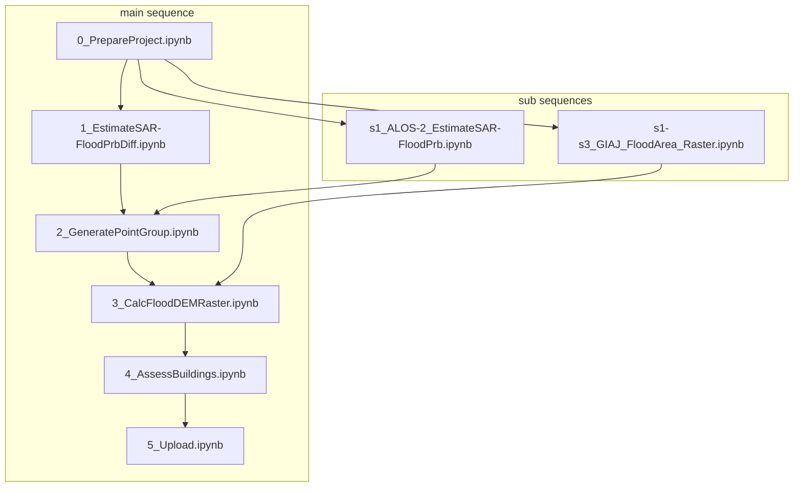
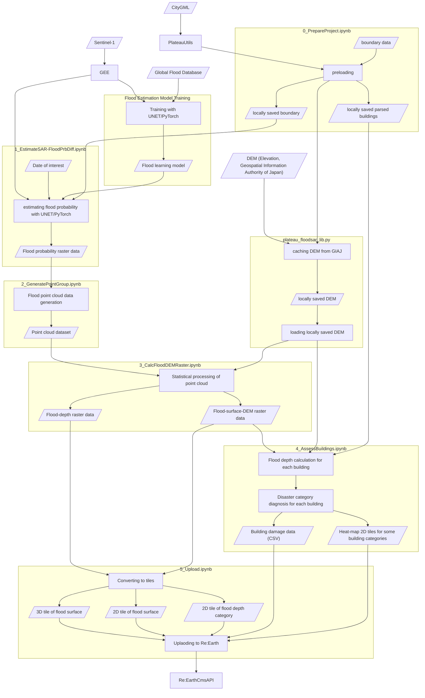

# Flood Analysis with SAR for project PLATEAU

## Overall Description
This project is a usecase for PLATEAU in FY2023. This repository utilizes SAR and other datasources to estimate flood area and depth and evaluates the damage of each building in the city of interest.

This project has been tested on Google Colaboratory (2023.Nov).

## Installation
The easiest way to deploy this repository is clicking this link =>  and running it on Google Colaboratory. It will download all you need to your Google drive including model files not stored on this GitHub repository. 

## Descriptions of Source Codes under PLATEAU-FloodSAR directory 
This repository is designed to be deployed on Google Drive and used primarily through Google Colab. The notebooks should be executed in the order indicated by the sequential numbers at the beginning of their filenames. Each notebook first downloads necessary data and caches precomputed data on Google Drive for memory efficiency and reusability. Subsequent notebooks utilize these cached data for predictions. Therefore, it's essential to authorize Google Drive connection and create a working directory on Google Drive. The path to this directory must be set before executing the notebooks. **Note: Attention the available space on your Google Drive, especially when making predictions over extensive areas.**

**main / sub sequences**: Main sequence consists of 6 notebooks + 1 python file and utilizes Sentinel-1 data from Google Earth Engine. Sub sequences utilize other data sources such as flood area JSON from GIAJ.

<bf>Detailed diagram</bf>

	

**sub-sequence notation on the file name**: notebook files wich names start with "s" belong to sub sequences. A sub-branch file substitutes the step(s) of the main sequence associated with the number(s) following to "s" or in range noted as "s#-s#".

### Analysis with Sentinel-1 from Google Earth Engine (main sequence) 

<bf>Detailed diagram</bf>

#### Flood Estimation Model Training (already run for you)

Inputs: Global Flood Database

Output: Flood Learning Model (VV/VH, VV)

This step involves creating a flood learning model that classifies Sentinel-1 observations based on the flood areas from the Global Flood Database. The classifier comes in two versions: a dual polarization version (VV/VH) and a single polarization version (VV). The source code is stored in `training` directory. **This step is already run for you and the resultant models will be downloaded via the installation previously described. Basically you don't need to run this step by yourself.** 

#### 0_PrepareProject.ipynb
Inputs: CityGML, boundary of interest

Output: boundary, parsed building data, locally cached DEM

Initializes the project by setting up the case name and defining the area of interest. Parses CityGML to generate building data within the specified area and pre-downloads Digital Elevation Model (DEM, 5m mesh from the Geospatial Information Authority of Japan).
- **Required Procedures**: Connection to Google Drive.

#### 1_EstimateSAR-FloodPrbDiff.ipynb
Inputs: Sentinel-1 (from Google Earth Engine), Flood Learning Model, Date of intereset, boundary

Output: Flood raster data (Probability Difference)

Flood classification of Sentinel-1 observations is conducted using the flood learning model. In the main branch, the dual polarization version of the model is used. The output is flood probability raster data (logit), showing the difference in flood probability between the time of the event and its previous regression.
- **Required Procedures**: Authentication with Google Earth Engine (GEE), Connection to Google Drive.

#### 2_GeneratePointGroup.ipynb
Inputs: Flood raster data (logit) 

Output: Flood point cloud data

In this step, pixels with probability differences above a certain threshold in the flood raster data are classified as flooded. Then, pixels are converted to numerous random points which form point cloud data to overcome the difference of the grid systems. Parameters are adjustable.
- **Required Procedures**: Connection to Google Drive.

#### 3_CalcFloodDEMRaster.ipynb
Inputs: Flood Raster Data (logit), DEM 

Output: Flood surface DEM raster data, Flood depth raster data

Generates flood surface elevation raster data and depth data from point cloud data. Parameters are adjustable.

- **Required Procedures**: Connection to Google Drive.

#### 4_AssessBuildings.ipynb
Inputs: parsed building data, DEM, Flood surface DEM raster Data

Output: Building Damage Data (CSV), 2D tiles of heatmaps for some building categories

The flood depth for each building is determined by the difference in elevation between the building's location in the DEM and the flood level. The buildings are then categorized into different disaster categories based on their structure and flood depth, either above or below the ground level.

Generates disaster data for buildings using building data and flood surface elevation raster data.
- **Required Procedures**: Connection to Google Drive.

#### 5_Upload.ipynb
Input: Building Damage Data (CSV), 2D tiles of heatmaps for some building categories, Flood surface DEM raster Data, Flood depth raster data

Output: 2Dtile of flood surface dem, 2Dtile of flood depth

Uploads data to Re:Earth CMS. Please use s5_SelectedFileUpload.ipynb if you simply want to upload files without generating 2D tiles at this file.
- **Required Procedures**: Connection to Google Drive, Authentication with Re:Earth CMS.

#### plateau_floodsar_lib.py
- Called in steps 0, 3, and 4.
- Downloads and locally saves DEM tiles from the Geospatial Information Authority of Japan, integrates multiple types (e.g., DEM5A, DEM5B), calculates geoid height, and extracts and fills values for the specified area. (Includes 4 classes)

### Analysis with GIAJ flood area GeoJSON file (sub sequence)
#### s1-s3_GIAJ_FloodArea_Raster.ipynb
- Works with locally stored JSON file.
- Generates flood surface elevation raster data from GIAJ GeoJson.
- Substitutes the main steps 1 ~ 3.
- After runnning this file, please continue at the main step 4.

### Analysis with ALOS-2 (sub sequence)
#### s1_ALOS-2_EstimateSAR-FloodPrb.ipynb
- This code is under review.
- This is a prototype and not tested with practical flood data.
- Works with locally stored GeoTIFF files. 
- Generates flood probability raster data (logit) from **local** ALOS-2 SAR data (TIFF).
- **Required Procedures**: Connection to Google Drive. **Upload local ALOS-2 SAR data into Google Drive** and specify location `tiff_path`.
- **Required Files**: Model files
- **Attention**: The area of interest must be included within the local SAR TIFF file since this file is a prototype.
  
### Analysis with ASNARO-2 (sub sequence)
#### s1-s2_ASNARO-2_EstimateSAR_FloodPrb.ipynb
- Works with locally stored GeoTIFF file.
- Classicaly analyzed with back scatter coefficient from one scene.
- **Required Procedures**: Connection to Google Drive. **Upload local ASNARO-2 SAR data into Google Drive** and specify location `tiff_path`.

### Uploading some selected files (sub sequence)
#### s5_SelectedFileFupload.ipynb
- Uploading functionality only.
- You can select which files to be uploaded.
- Assuming uploading some updates.
- **Required Procedures**: Connection to Google Drive, Authentication with Re:Earth CMS.

## Boundary Samples
Please use these sample GeoJSONs in boundary_samples directory for 0_PrepareProject upon your needs.

## Model files
Following PyTorch model files are stored outside of this GitHub repository due to the filesize limitation. They will be downloaded to your Google drive automatically if you use our installation code Git2Colab_Installation_PLATEAU_FloodSAR.ipynb.
- model_epoch_vv_119.pth https://drive.google.com/file/d/1VEgB3VcLOYEwud9Zo-QsHUAMmNkrGDZq/
- model_epoch_aug_mask_100.pth https://drive.google.com/file/d/1rD68QJQr-gmF9jeZY5qBjVJJqoWOFe7E/
