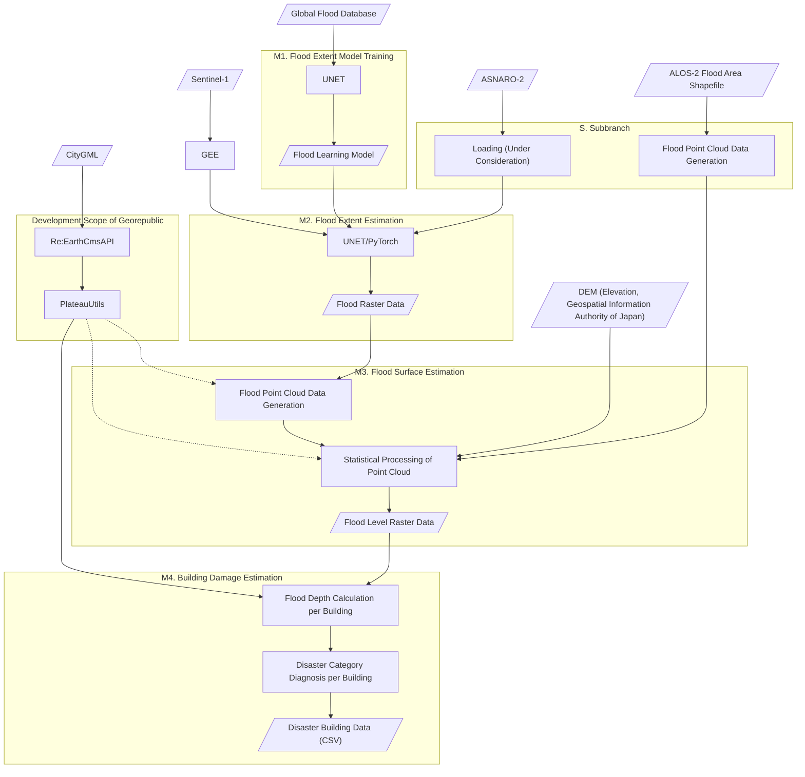

# Flood Analysis with SAR and PLATEAU
This is a usecase for PLATEAU in FY2023.

This project has been tested on Google Colaboratory (2023.Nov).

## Installation
The easiest way to deploy this repository is clicking this link =>  and running it on Google Colaboratory. It will download all you need to your Google drive including model files not stored on this GitHub repository. 

## Overall Description

### Main Branch Steps

**M1. Flood Estimation Model Training**

Inputs: Global Flood Database

Output: Flood Learning Model (VV/VH, VV)

This step involves creating a flood learning model that classifies Sentinel-1 observations based on the flood areas from the Global Flood Database. The classifier comes in two versions: a dual polarization version (VV/VH) and a single polarization version (VV).

**M2. Flood Extent Estimation**

Inputs: Sentinel-1 (from Google Earth Engine), Flood Learning Model, Date of the Event

Output: Flood Raster Data (Probability Difference)

Flood classification of Sentinel-1 observations is conducted using the flood learning model. In the main branch, the dual polarization version of the model is used. The output is flood raster data, showing the difference in flood probability between the time of the event and its previous regression.

**M3. Flood Surface Estimation**

Inputs: Flood Raster Data (Probability Difference), DEM (5m mesh from the Geospatial Information Authority of Japan)

Output: Flood Level Raster Data

In this step, areas with probability differences above a certain threshold in the flood raster data are classified as flooded. Numerous random points are generated within each pixel, forming a point cloud of the flood. Coordinate system transformation is also performed in this step.

<!-- Statistical processing is conducted for each point in the flood point cloud. For more details, refer to the later section on 'Statistical Processing of Point Cloud'. -->

**M4. Building Damage Estimation**

Inputs: Building Data, DEM, Flood Level Raster Data

Output: Building Damage Data (CSV)

The flood depth for each building is determined by the difference in elevation between the building's location in the DEM and the flood level. The buildings are then categorized into different disaster categories based on their structure and flood depth, either above or below the ground level.

## Descriptions of Source Codes under PLATEAU-FloodSAR directory 
This repository is designed to be deployed on Google Drive and used primarily through Google Colab. The notebooks should be executed in the order indicated by the sequential numbers at the beginning of their filenames. Each notebook first downloads necessary data and caches precomputed data on Google Drive for memory efficiency and reusability. Subsequent notebooks utilize these cached data for predictions. Therefore, it's essential to authorize Google Drive connection and create a working directory on Google Drive. The path to this directory must be set before executing the notebooks. Additionally, be mindful of the available space on Google Drive, especially when making predictions over extensive areas.

**main / sub branches**: Main branch consists of 6 notebooks + 1 python file and utilizes Sentinel-1 data from Google Earth Engine. Sub branches utilize other data sources such as flood area JSON from GIAJ.

**sub-brance notation on the file name**: notebook files wich names start with "s" belong to sub branches. A sub-branch file substitutes the step(s) of the main branch associated with the number(s) following to "s" or in range noted as "s#-s#".

### Analyze with Sentinel-1 from Google Earth Engine (main branch) 
#### 0_PrepareProject.ipynb
- Initializes the project by setting up the case name and defining the area of interest. Parses CityGML to generate building data within the specified area and pre-downloads Digital Elevation Model (DEM).
- **Required Procedures**: Connection to Google Drive.

#### 1_EstimateSAR-FloodPrbDiff.ipynb
- Acquires Sentinel-1 data for the area of interest and generates flood probability raster data (logit).
- **Required Procedures**: Authentication with Google Earth Engine (GEE), Connection to Google Drive.
- **Required Files**: Model files
  
#### 2_GeneratePointGroup.ipynb
- Creates point cloud data from flood probability raster data. Parameters are adjustable.
- **Required Procedures**: Connection to Google Drive.

#### 3_CalcFloodDEMRaster.ipynb
- Generates flood surface elevation raster data from point cloud data. Parameters are adjustable.
- **Required Procedures**: Connection to Google Drive.

#### 3_GIAJ-CalcFloodDEMRaster.ipynb
- Produces flood surface elevation raster data from flood area GeoJSON published by the Geospatial Information Authority of Japan.
- **Required Procedures**: Connection to Google Drive.

#### 4_AssessBuildings.ipynb
- Generates disaster data for buildings using building data and flood surface elevation raster data.
- **Required Procedures**: Connection to Google Drive.

#### 5_Upload.ipynb
- Uploads data to Re:Earth CMS.
- **Required Procedures**: Connection to Google Drive, Authentication with Re:Earth CMS.

#### plateau_floodsar_lib.py
- Called in steps 0, 3, and 4.
- Downloads and locally saves DEM tiles from the Geospatial Information Authority of Japan, integrates multiple types (e.g., DEM5A, DEM5B), calculates geoid height, and extracts and fills values for the specified area. (Includes 4 classes)

### Analyze with GIAJ flood area JSON file (sub branchs)
(under construction)
with locally stored JSON file.
#### s1-s3_GIAJ_FloodArea_Raster.ipynb
- Substitutes the main steps 1 ~ 3.
- After runnning this file, please continue at the main step 4.

### Analyze with ALOS-2 (sub branchs)
(under review)
with locally stored GeoTIFF files. 

#### s1_ALOS-2_EstimateSAR-FloodPrb.ipynb
- This is a prototype and not tested with practical flood data.
- generates flood probability raster data (logit) from **local** ALOS-2 SAR data (TIFF).
- **Required Procedures**: Connection to Google Drive. **Upload local ALOS-2 SAR data into Google Drive** and specify location `tiff_path`.
- **Required Files**: Model files
- **Attention**: The area of interest must be included within the local SAR TIFF file since this file is a prototype.
  
### Analyze with ASNARO-2 (sub branchs)
(under construction)
with locally stored GeoTIFF file. Classicaly analyzed with back scatter coefficient from one scene.
#### files

## Boundary Samples
Please use these sample GeoJSONs in boundary_samples directory for 0_PrepareProject upon your needs.

## Traninging code
Training directory contains the code used to train and generate our machine learning models.

## Model files
Following PyTourch model files are stored outside of this GitHub repository due to the filesize limitation. They will be downloaded to your Google drive automatically if you use our installation code Git2Colab_Installation_PLATEAU_FloodSAR.ipynb.
- model_epoch_vv_119.pth https://drive.google.com/file/d/1VEgB3VcLOYEwud9Zo-QsHUAMmNkrGDZq/
- model_epoch_aug_mask_100.pth https://drive.google.com/file/d/1rD68QJQr-gmF9jeZY5qBjVJJqoWOFe7E/
